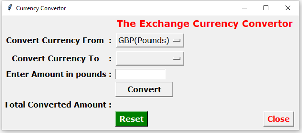

# Currency Converter

A simple desktop currency converter built with **Python** and **Tkinter**. This project was completed as part of a **college programming assignment** and demonstrates GUI development, event-driven programming, input validation, and basic currency conversion logic.

---

## 📸 Screenshot



---

## 📖 Overview

The application allows users to convert an amount entered in **British Pounds (GBP)** into selected international currencies using predefined exchange rates.

The project was designed for an exchange company scenario where staff needed a simple and easy-to-use tool for converting GBP into other currencies.

---

## ✨ Features

- Convert British Pounds (GBP) to:
  - Euro (EUR)
  - US Dollar (USD)
  - Canadian Dollar (CAD)
  - United Arab Emirates Dirham (AED)
- Graphical user interface using Tkinter
- Dropdown currency selection
- Input validation for invalid or empty values
- Error messages using Tkinter message boxes
- Reset button to clear the form
- Close button to exit the application
- Rounded conversion results

---

## 🛠 Tech Stack

- Python
- Tkinter

---

## 📂 Project Structure

```text
currency-converter-python/
│
├── currency_converter.py
├── README.md
├── .gitignore
│
├── images/
│   └── currency_converter.png
│
└── docs/
    └── Programming_Assignment.odt
```

---

## ▶️ How to Run

1. Make sure **Python 3** is installed.
2. Clone or download this repository.
3. Open the project folder in a terminal.
4. Run the application:

```bash
python currency_converter.py
```

---

## 🧠 Programming Concepts Demonstrated

- Functions
- Conditional statements
- Variables
- Float data type usage
- Input validation
- Exception handling
- Event-driven programming
- GUI development
- User input processing

---

## 🎯 What I Learned

Through this project, I learned how to:

- Build a desktop GUI application using Tkinter
- Use dropdown menus, labels, buttons, and input fields
- Validate user input and display error messages
- Apply conditional logic to process different conversion options
- Improve a program based on testing and feedback
- Structure a simple Python application using functions

---

## 📌 Notes

This project was created for educational purposes as part of a college programming assignment. The exchange rates are hard-coded and were used for the purpose of demonstrating currency conversion logic.
